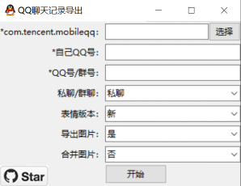
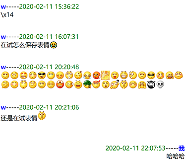
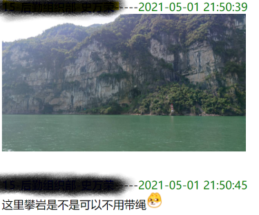

# QQ聊天记录导出

## 声明

本项目仅供学习交流使用，严禁用于任何违反中国大陆法律法规、您所在地区法律法规、[QQ软件许可及服务协议](https://rule.tencent.com/rule/preview/46a15f24-e42c-4cb6-a308-2347139b1201)的行为，本人不承担任何相关行为导致的直接或间接责任。

本项目理论仅能将可以通过正常方法查看的聊天记录**导出**，而不能进行包括但不限于已删除聊天记录恢复在内的操作。

本项目不对生成内容的完整性、准确性作任何担保，因此生成的一切内容**没有法律效力**，您不应当将其用于学习与交流外的任何用途。

本项目不接受一切形式的物质捐赠，请勿以此项目为由向我进行任何捐赠。

### 源代码共享

本文档的[致谢](https://github.com/Young-Lord/QQ-History-Backup/tree/master#致谢)部分列出了使用的非本项目内容及其协议（如果适用），此部分内容遵循原版权方要求共享。

除此以外，本项目源代码及资源除以注释等形式特殊说明外，基于[GPL v3](https://github.com/Young-Lord/QQ-History-Backup/blob/master/LICENSE)共享。

## 简介

作为国内最常用的聊天工具之一，QQ 为了用户留存度，默认聊天记录备份无法脱离 QQ 被独立打开。

目前版本往往需要通过命令行运行，本方法在之前版本的基础上简化了操作，制作了GUI方便使用；并且不再需要提供密钥，自动填入备注/昵称，添加了QQ表情、图片和语音的一并导出。

### 打包版本下载

本项目使用 GitHub Actions 构建了 PyInstaller 打包版，适用于 64 位 Windows 系统。你可以在以下两处下载：

- [GitHub Actions 页面](https://github.com/Young-Lord/QQ-History-Backup/actions)：需登录，文件自生成起90天后过期，保证基于最新代码，不稳定

- [GitHub Releases 页面](https://github.com/Young-Lord/pyinstaller/releases/latest)：不需登录，文件不过期，但不一定基于最新代码，较稳定

下载完成后，双击运行。

### 直接运行

#### 基础环境

1. 一切操作之前，你需要先安装 Python 3.x（建议使用可下载的最高版本，已知支持`3.12`），可参考[此文章（Windows）](https://zhuanlan.zhihu.com/p/458428159)。
2. 然后，在当前目录打开终端，Windows 用户若不懂可以看[这篇博文](https://blog.csdn.net/Lzy410992/article/details/105937780)
3. 执行以下命令永久加速相关依赖的下载（换源）：`pip config set global.index-url https://pypi.tuna.tsinghua.edu.cn/simple`

#### 安装依赖

首先，在上文打开的命令行中执行：`pip install -r requirements.txt`

##### 语音解码相关依赖

如果你需要解码语音文件，请使用以下任意一种方法。否则，你可以直接跳过此部分。

如果你的系统为 Windows，你可以直接下载[扩展包](https://github.com/ZhangJun2017/QQChatHistoryExporter/releases/download/v1.1/QQChatHistoryExporter_v1.1_extra.zip)并将`silk_v3_decoder.exe`与`ffmpeg.exe`放置在`assets`文件夹内。

否则，你可以执行以下命令：`pip install av pilk`

##### 类型未适配？

欢迎将你的样本文件以[邮箱方式](mailto:ly-niko@qq.com)发给我！

请注意，我不对此过程中的一切损失负责，但我也保证不会将你的数据与第三方共享。如果你不放心传输过程中的数据安全，可以使用`encrypter`中的工具加密。

#### 运行

图形界面：`python GUI.py`

命令行：`python cli.py`

命令行终端：`python repl.py`

Web 界面：`python webui.py`

文件版：编辑`code.py`最下面的内容，并运行：`python code.py`

文件版（JSON）：编辑`code_by_json_config.json`最下面的内容，并运行：`python code_by_json.py`

## 获取聊天记录文件（安卓）

> 注：以下提到的“电脑”泛指一切可以运行此程序的环境，如安卓手机上的 Termux 也属于此列

> 注：以下内容假设您使用的是 QQ 而非 TIM，如果您在使用 TIM，请将`com.tencent.mobileqq`改为`com.tencent.tim`，将`MobileQQ`改为`Tim`

如果手机已获得 root 权限，聊天记录可在以下路径找到。

```
/data/data/com.tencent.mobileqq/
```

我们需要的文件只有`databases/<QQ号>.db`，`databases/slowtable_<QQ号>.db`，`files/kc`，因此您可以将整个文件夹压缩后传输到电脑上，亦或将这三个文件单独放在同一个目录中传输。本程序会自动识别这两种不同的目录结构。

如果没有 root 权限，可以通过手机自带的备份工具备份整个 QQ，拷贝备份文件到电脑，解压找到 `com.tencent.mobileqq`。

具体方法可以参见

> 怎样导出手机中的QQ聊天记录？ - 益新软件的回答 - 知乎
> <https://www.zhihu.com/question/28574047/answer/964813560>

关于苹果设备导出，参见[此讨论](https://github.com/Yiyiyimu/QQ-History-Backup/issues/42)；对于安卓系统导出内容的提取，请自行在互联网查询。

如果同时需要在聊天记录中显示图片，拷贝手机中 `/sdcard/Android/data/com.tencent.mobileqq/Tencent/MobileQQ/chatpic` 前文得到的 `com.tencent.mobileqq` 目录下。

（QQ）如果同时需要在聊天记录中显示语音，拷贝手机中 `/sdcard/Android/data/com.tencent.mobileqq/Tencent/MobileQQ/<QQ号>/ptt` 至前文得到的 `com.tencent.mobileqq` 目录下。

（TIM）如果同时需要在聊天记录中显示语音，拷贝手机中 `/sdcard/Android/data/com.tencent.tim/Tencent/Tim/ptt/<QQ号>` 至前文得到的 `com.tencent.mobileqq` 目录下，并重命名为`ptt`。

## GUI使用方法



- `com.tencent.mobileqq`：选择导出的相应文件夹，对于备份方式，一般为`apps/com.tencent.mobileqq`
- 表情版本：默认为新版QQ表情。如果你的聊天记录来自很早以前，可以切换为旧版的表情
- 导出所有记录：若此项选择“是”，则`QQ号/群号：`与`私聊/群聊：`选项会被忽略。
- 导出图片：若此项与前一项均选择“是”，必须把`chatpic`目录复制到生成的`output_xxx`目录下，图片才能正常显示
- 合并图片：默认为否
  - 不启用合并图片好处在于：1. 使导出的 HTML 文件具有可读性；2. 减小 HTML 文件体积方便打开
  - 启用合并图片好处：拷贝时不需要和 `emoticon` 以及 `chatpic` 文件夹一起拷贝，更加方便

## 输出截图




如果没有启用合并图片，拷贝生成的聊天记录时需要一起拷贝 `emoticon` 以及 `chatpic` 文件夹.

有 bug 的话提 issue，记得附上 log.txt 里的内容以及终端的报错内容。

## TODO

- [x] 支持群聊导出
- [x] 支持自动查找密钥
- [x] 使用好友/群聊昵称作为默认用户名
- [x] 自动合并 db 和 slow-table
- [x] 支持新 QQ emoji
- [x] 支持单一文件导出
- [x] 支持音频导出
- [ ] 支持视频导出
- [ ] 支持合并转发消息导出
- [ ] 支持戳一戳导出
- [ ] 支持缩略图
- [ ] 支持卡片分享
- [ ] 重构代码
- [ ] 加入 i18n 与自定义翻译支持
- [ ] 支持使用[silk-v3-decoder](https://github.com/ZhangJun2017/QQChatHistoryExporter)转换音频文件
- [ ] 使用 Jinja2 生成 HTML 文件
- [ ] 允许插入自定义 CSS 与 自定义 JS
- [ ] 分析并试图优化解密相关函数
- [ ] 更新预览图
- [ ] 基于 GitHub Actions 以 PyInstaller 生成在 Windows 下的可执行文件
- [ ] [导出表情商城内的表情](https://github.com/Yiyiyimu/QQ-History-Backup/issues/46)
- [ ] 支持 JSON 格式导出
- [ ] 支持 Msg3.0.db 的导出并提供相关教程
- [ ] 支持 Icalingua++ 聊天记录的导出 及 转换至 Icalingua++ 格式
- [ ] 增加提交文件加密工具
- [ ] 优化文档


## FAQ

- **聊天记录中显示 `[图片]` 是因为什么？**

   解码出的图片路径在 `chatimg` 找不到相应文件。可能原因为在手机中没有加载过该文件，导致图片没有存在手机里。

## CHANGELOG

### v2

- 直接从 `files/kc` 提取明文的密钥，不用再手动输入或解密
- 支持群聊记录导出
- 支持 私聊/群聊 的 备注/昵称 自动填入
- 支持 slowtable 的直接整合
- 支持新版 QQ 表情

### v2.2

- 支持导出图片至聊天记录
- 支持合并图片至单一文件方便传输

### v2.3

- 支持读取不同的目录结构
- 支持单独导出一个私聊对话或群聊对话
- 部分修复解密函数存在的 bug
- 支持批量导出
- 修复导出的 HTML 中的字符转义

### v2.4

- 支持读取音频

## 致谢

[roadwide/qqmessageoutput](https://github.com/roadwide/qqmessageoutput)

[WincerChan/export.py](https://gist.github.com/WincerChan/362331456a6e0417c5aa1cf3ff7be2b7)

[Yiyiyimu/QQ-History-Backup](https://github.com/Yiyiyimu/QQ-History-Backup) （本仓库的来源，致敬！同时，源代码基于 MIT 协议使用。）

[ZhangJun2017/QQChatHistoryExporter](https://github.com/ZhangJun2017/QQChatHistoryExporter) （参考了 Protobuf 相关内容）

`assets/img/emotion/`下的一切文件以及`img/GUI.png`、`img/images.png`、`img/layout.png`版权归`深圳市腾讯计算机系统有限公司`所有，在遵循相关条款情况下使用。

`assets/img/github_star.png`版权归`GitHub`所有。

`img/onimai_meme.jpg`图源 QQ 群聊 628886308。

本项目部分代码使用了 GitHub Copilot 与 ChatGPT，如果您认为侵犯了您的权益，请联系我。

## 适配新类型笔记

1. 下载 [protoc](https://github.com/protocolbuffers/protobuf/releases) 这一可执行文件，设置可执行权限（仅 Linux 类系统）并移动到适当位置（位于 PATH 环境变量中的目录）

2. 编辑`proto/RichMsg.proto`，增加新类型（可以参照[此项目](https://github.com/ZhangJun2017/QQChatHistoryExporter/blob/f97eb64581229a30514d55aa0a8423b138b09437/src/RawMessage.java#L41)）

3. 切换到目录`proto`中，运行`compile`，在 Windows 下需先将其改名为`compile.bat`

4. 编辑`QQ_History.py`中的`decrypt`，加入`msgtype`对应判断与处理代码

5. **记得写文档**

